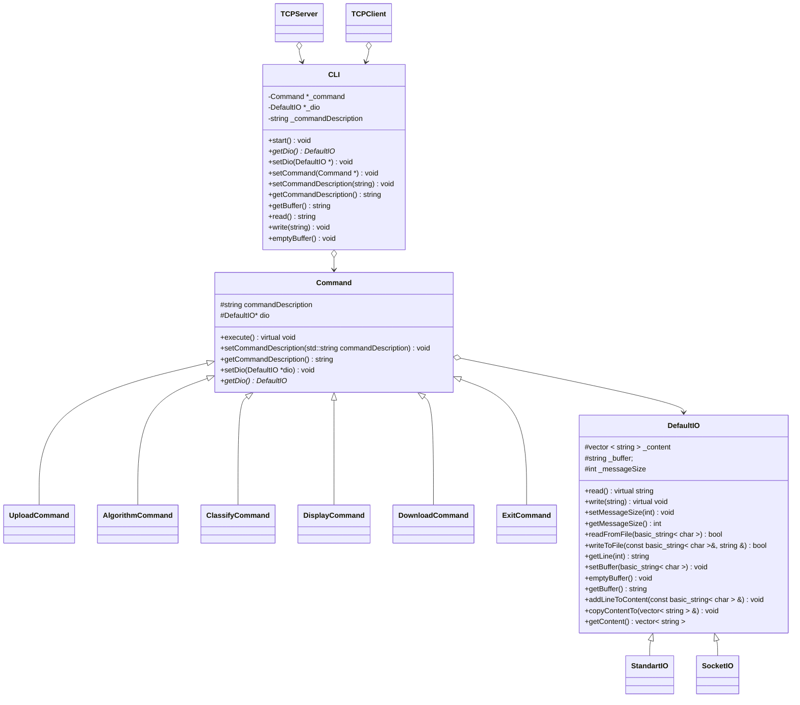

## About
This project is part of our Advance Programing course in Computer Science major.
> ***more will be added as we advance the course***

## Milestone 3

This assignment we worked on implementing a server and client side network,
Based on the previous milestone, we implemented the KNN algorithm by letting the user enter a menu option and making the server do a certain action as described below in `accepted input from user`. The distance algorithm we used are the follow algorithms:

- 📐 *Euclidean Distance* 📐

$$
{\displaystyle d(p,q)={\sqrt {(p_{1}-q_{1})^{2}+(p_{2}-q_{2})^{2}+\cdots +(p_{i}-q_{i})^{2}+\cdots +(p_{n}-q_{n})^{2}}}}
$$

- 📐 *Manhattan Distance* 📐

$$
{\displaystyle d(\mathbf {p} ,\mathbf {q} )=\left\|\mathbf {p} -\mathbf {q} \right\|_=\sum _{i=1}^{n}\left|p_{i}-q_{i}\right|}
$$
- 📐 *Chebyshev Distance* 📐

$$
{\displaystyle \lim _{p\to \infty }{\bigg (}\sum _{i=1}^{n}\left|x_{i}-y_{i}\right|^{p}{\bigg )}^{1/p}}
$$

- 📐 *Canberra Distance* 📐

$$
d(\mathbf {p} ,\mathbf {q} )=\sum _{i=1}^{n}{\frac {|p_{i}-q_{i}|}{|p_{i}|+|q_{i}|}}
$$

- 📐 *Minkowski Distance* 📐

$$
{\displaystyle d\left(x,y\right)=\left(\sum _{i=1}^{n}|x_{i}-y_{i}|^{p}\right)^{\frac {1}{p}}}
$$

Using those distance algorithms we can calculate the nearest representation of an element (in this case a vector) and classify it accordingly.

### UML Diagrams



### Accepted Input from client
The following input discuss about the input of the user inside the client side (menu options)
|Menu Option|Description                  |
|Menu Option|Description|
|--------------------------------|-----------------------------|
|`1`|User will be asked to upload a local `train file` and then a local `test file`. make sure the file exists and not empy otherwise server will reject the upload input
|`2`|User will be asked to enter a `k` value and a `distance algorith`, make sure that `k` is greater then 0 and that the distance algorithm is one of the follow input **`AUC`** for Euclidean, **`MAN`** for Manhattan, **`CHB`** for Chebyshev's, **`CAN`** for canberra, **`MIN`** for minkowski.
|`3`|Server will `classify` the `test file` based on the `train file`. make sure that you first upload the data, if for any reason the data is corrupt (meaning you entered strings where numbers should have been inside the train file), the KNN algorithm will refer to those values as the value `0`. if the data inside the test file does not match the data inside the train file the server will output an error to the user about that. The error may very based on the why the classification resulted in an error
|`4`|Server will send to client the `classified` data and the client will print it to the user. Make sure to first upload and classify the data other wise a message will be thrown to the user. After reciving the data the server will wait for user to press `enter` before printing the menu again.
|`5`|Server will ask the user to input a download `file` and in return the server will download the `classified` data inside that `file` **be aware that any data inside this file will be over-written!**. If for any reason the download failed or couldn`t take place, server will output a message to the user.
|`8`|The connection to the server will be `terminated`, and all data regards the user in the server will be `lost`.


## Files Structure 
```
.
├──app
│	├──header
│	│	├── CLI.h
│	│	├── Command.h
│	│	├── DefaultIO.h
│	│	└── StandartIO.h
│	└──src
│		├── CLI.cpp
│		├── Command.cpp
│		├── DeaultIO.cpp
│		└── StandartIO.cpp		
├── server
│	├── ServerSide.cpp
│	├── ServerSide.h
│	├── src
│	│	├── DIO
│	│	│	└── SocketIO.cpp
│	│	├── commands
│	│	│	├── AlgoSetCommand.cpp
│	│	│	├── ClassifyDataCommand.cpp
│	│	│	├── ExitCommand.cpp
│	│	│	├── SendFileCommand.cpp
│	│	│	└── UploadCommand.cpp
│	│	├── distance
│	│	│	├── Distance.cpp
│	│	│	├── CanberraDistance.cpp
│	│	│	├── MinkowskiDistance.cpp
│	│	│	├── EuclideanDistance.cpp
│	│	│	├── ChebyshevDistance.cpp
│	│	│	└── ManhattanDistance.cpp
│	│	├── factory
│	│	│	├── DistanceFactory.cpp
│	│	│	└── ServerCommandFactory.cpp
│	│	├── util
│	│	│	├── Util.cpp
│	│	│	├── Fanctor.cpp
│	│	│	└── Manager.cpp
│	│	├── database
│	│	│	├── Classification.cpp
│	│	│	└── DataBase.cpp
│	│	└── TCP
│	│		└── TCP_Server.cpp
│	│
│	└── header
│		├── DIO
│		│	└── SocketIO.h
│		├── commands
│		│	├── AlgoSetCommand.h
│		│	├── ClassifyDataCommand.h
│		│	├── ExitCommand.h
│		│	├── SendFileCommand.h
│		│	└── UploadCommand.h
│		├── distance
│		│	├── Distance.h
│		│	├── CanberraDistance.h
│		│	├── MinkowskiDistance.h
│		│	├── EuclideanDistance.h
│		│	├── ChebyshevDistance.h
│		│	└── ManhattanDistance.h
│		├── factory
│		│	├── DistanceFactory.h
│		│	└── ServerCommandFactory.h
│		├── util
│		│	├── Util.h
│		│	├── Fanctor.h
│		│	└── Manager.h
│		├── database
│		│	├── Classification.h
│		│	└── DataBase.h
│		└── TCP
│			└── TCP_Server.h
│	
│
└── client
	├── ClientSide.cpp 
	├── ClientSide.h
	├── src
	│	├── Command
	│	│	├── ClientAlgorithCommand.cpp
	│	│	├── ClientClassifyCommand.cpp
	│	│	├── ClientDisplayCommand.cpp
	│	│	├── ClientDownloadCommand.cpp
	│	│	├── ClientUploadCommand.cpp
	│	│	├── ClientExitCommand.cpp
	│	│	└── ClientCommandFactory.cpp
	│	├── TCP
	│	│	└── TCPClient.cpp
	│	└── Manager
	│		└── ClientManager.cpp
	└── header
		├── Command
		│	├── ClientAlgorithCommand.h
		│	├── ClientClassifyCommand.h
		│	├── ClientDisplayCommand.h
		│	├── ClientDownloadCommand.h
		│	├── ClientUploadCommand.h
		│	├── ClientExitCommand.h
		│	└── ClientCommandFactory.h
		├── TCP
		│	└── TCPClient.h
		└── Manager
			└── ClientManager.h
```

## Compiling and Running

#### Compiling using makefile

```
make
./server.out port
./client.out ip port
```
make sure ip/port are correct otherwise an error will be thrown and the program will return 1 and close.
  

## Authors
- [@RonenSiv](https://www.github.com/RonenSiv)

- [@Ofirhelerman](https://www.github.com/Ofirhelerman)
