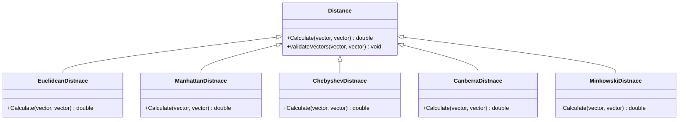

# KNN Machine Learning Algorithm with Socket Programming

Welcome to the KNN Machine Learning Algorithm with Socket Programming README! This project is a C++ implementation of the K-Nearest Neighbors (KNN) machine learning algorithm with the added functionality of socket programming for smooth communication and interaction with clients.


## Supported Distance Metrics

- 📐 **Euclidean Distance** 📐

  

- 📐 **Manhattan Distance** 📐

  

- 📐 **Chebyshev Distance** 📐

  

- 📐 **Canberra Distance** 📐

  

- 📐 **Minkowski Distance** 📐

  


## Features

- **K-Nearest Neighbors**: Implement the KNN machine learning algorithm to classify data based on the nearest neighbors.
- **Socket Programming**: Utilize socket programming to establish communication channels and interact with clients.
- **Client-Server Architecture**: Enable multiple clients to connect and send data for classification using the KNN algorithm.
- **Real-Time Classification**: Perform real-time classification of data sent by clients using the trained KNN model.
- **Customization**: Adjust the K value, distance metric, and other parameters to fine-tune the KNN algorithm.

## How to Use

1. Clone the repository to your local machine.
2. Compile the C++ code using the makefile provided (or any other compiler).
3. Start the server application by running the executable.
4. Clients can connect to the server using the provided IP address and port number.
5. Clients can send data to the server for classification.
6. The server performs classification using the KNN algorithm and sends the results back to the clients.
7. Analyze the classification results and evaluate the performance of the KNN model.

## Technologies Used

- C++
- Socket Programming


### UML Diagrams



### Accepted Input from client
The following input discuss about the input of the user inside the client side (menu options)
|Menu Option|Description                  |
|Menu Option|Description|
|--------------------------------|-----------------------------|
|`1`|User will be asked to upload a local `train file` and then a local `test file`. make sure the file exists and not empy otherwise server will reject the upload input
|`2`|User will be asked to enter a `k` value and a `distance algorith`, make sure that `k` is greater then 0 and that the distance algorithm is one of the follow input **`AUC`** for Euclidean, **`MAN`** for Manhattan, **`CHB`** for Chebyshev's, **`CAN`** for canberra, **`MIN`** for minkowski.
|`3`|Server will `classify` the `test file` based on the `train file`. make sure that you first upload the data, if for any reason the data is corrupt (meaning you entered strings where numbers should have been inside the train file), the KNN algorithm will refer to those values as the value `0`. if the data inside the test file does not match the data inside the train file the server will output an error to the user about that. The error may very based on the why the classification resulted in an error
|`4`|Server will send to client the `classified` data and the client will print it to the user. Make sure to first upload and classify the data other wise a message will be thrown to the user. After reciving the data the server will wait for user to press `enter` before printing the menu again.
|`5`|Server will ask the user to input a download `file` and in return the server will download the `classified` data inside that `file` **be aware that any data inside this file will be over-written!**. If for any reason the download failed or couldn`t take place, server will output a message to the user.
|`8`|The connection to the server will be `terminated`, and all data regards the user in the server will be `lost`.


## Files Structure 
```
.
├──app
│	├──header
│	│	├── CLI.h
│	│	├── Command.h
│	│	├── DefaultIO.h
│	│	└── StandartIO.h
│	└──src
│		├── CLI.cpp
│		├── Command.cpp
│		├── DeaultIO.cpp
│		└── StandartIO.cpp		
├── server
│	├── ServerSide.cpp
│	├── ServerSide.h
│	├── src
│	│	├── DIO
│	│	│	└── SocketIO.cpp
│	│	├── commands
│	│	│	├── AlgoSetCommand.cpp
│	│	│	├── ClassifyDataCommand.cpp
│	│	│	├── ExitCommand.cpp
│	│	│	├── SendFileCommand.cpp
│	│	│	└── UploadCommand.cpp
│	│	├── distance
│	│	│	├── Distance.cpp
│	│	│	├── CanberraDistance.cpp
│	│	│	├── MinkowskiDistance.cpp
│	│	│	├── EuclideanDistance.cpp
│	│	│	├── ChebyshevDistance.cpp
│	│	│	└── ManhattanDistance.cpp
│	│	├── factory
│	│	│	├── DistanceFactory.cpp
│	│	│	└── ServerCommandFactory.cpp
│	│	├── util
│	│	│	├── Util.cpp
│	│	│	├── Fanctor.cpp
│	│	│	└── Manager.cpp
│	│	├── database
│	│	│	├── Classification.cpp
│	│	│	└── DataBase.cpp
│	│	└── TCP
│	│		└── TCP_Server.cpp
│	│
│	└── header
│		├── DIO
│		│	└── SocketIO.h
│		├── commands
│		│	├── AlgoSetCommand.h
│		│	├── ClassifyDataCommand.h
│		│	├── ExitCommand.h
│		│	├── SendFileCommand.h
│		│	└── UploadCommand.h
│		├── distance
│		│	├── Distance.h
│		│	├── CanberraDistance.h
│		│	├── MinkowskiDistance.h
│		│	├── EuclideanDistance.h
│		│	├── ChebyshevDistance.h
│		│	└── ManhattanDistance.h
│		├── factory
│		│	├── DistanceFactory.h
│		│	└── ServerCommandFactory.h
│		├── util
│		│	├── Util.h
│		│	├── Fanctor.h
│		│	└── Manager.h
│		├── database
│		│	├── Classification.h
│		│	└── DataBase.h
│		└── TCP
│			└── TCP_Server.h
│	
│
└── client
	├── ClientSide.cpp 
	├── ClientSide.h
	├── src
	│	├── Command
	│	│	├── ClientAlgorithCommand.cpp
	│	│	├── ClientClassifyCommand.cpp
	│	│	├── ClientDisplayCommand.cpp
	│	│	├── ClientDownloadCommand.cpp
	│	│	├── ClientUploadCommand.cpp
	│	│	├── ClientExitCommand.cpp
	│	│	└── ClientCommandFactory.cpp
	│	├── TCP
	│	│	└── TCPClient.cpp
	│	└── Manager
	│		└── ClientManager.cpp
	└── header
		├── Command
		│	├── ClientAlgorithCommand.h
		│	├── ClientClassifyCommand.h
		│	├── ClientDisplayCommand.h
		│	├── ClientDownloadCommand.h
		│	├── ClientUploadCommand.h
		│	├── ClientExitCommand.h
		│	└── ClientCommandFactory.h
		├── TCP
		│	└── TCPClient.h
		└── Manager
			└── ClientManager.h
```

## Compiling and Running

#### Compiling using makefile

```
make
./server.out port
./client.out ip port
```
make sure ip/port are correct otherwise an error will be thrown and the program will return 1 and close.
  

## Authors
- [@RonenSiv](https://www.github.com/RonenSiv)

- [@Ofirhelerman](https://www.github.com/Ofirhelerman)
